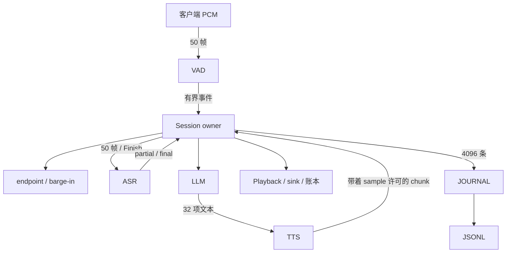

# 设计说明

这是一个单会话 Runtime。

## 架构

`Session::run` 是生命周期 owner。它独占两样东西：当前 generation，以及 Playback。Provider 跑在 JoinSet 里的本地任务中，WebRTC VAD 这种 `!Send` 的实例也留在同一条 LocalSet 线程上，没有为此加 unsafe。

`session.rs` 拆成 `input` / `generation` / `lifecycle` 三个私有模块，只是把转换函数按主题分开。调用仍是同一个 owner 上的同步方法。打断路径上没有因为拆文件多出 await。

## 状态与事件

输入和输出不要合成一个“听/说”开关。输入大致是 listening → 语音候选 → 确认说话 → 静音候选 → endpoint；输出是 idle → 等 ASR final → 流式播放 → 完成或取消。用户开口时，输出端往往还在播上一句。

身份是三层：`session_id` 跟着整个会话；VAD 确认连续语音时分配 `turn_id`；endpoint 提交时再发一个单调递增的 `generation_id`。ASR / LLM / TTS 事件必须带上这组身份，对不上就丢。还没有 generation 的事件，`generation_id` 为 0。

owner 接受事件时打一个全局 `sequence_number`，时间戳是 session 相对单调毫秒。日志至少覆盖：audio frame、speech start/end、endpoint committed、ASR partial/final、LLM / TTS chunk、audio enqueued、playback started / progress / stopped、generation cancelled、stale event dropped、session closed。只看一份 JSONL，应能解释这一次为什么是这个结果，而不用再猜内部状态。

## 并发、取消、有限队列

handle 的最后一个客户端引用消失，视为断开。显式 close、断开、后台 panic、sink 或 journal 挂掉，都走同一条关闭路径。ASR / LLM / TTS 超时只结束当前轮，输入还可以继续听；VAD 超时会关整个 session，因为已经听不见了。同一 generation 上重复 cancel 是幂等的。close 的优先级高于普通事件。

打断时 owner 先把旧 generation 拿掉（这一步就撤销了准入），再结算已经消费的音频、清空队列，最后才通知上游 soft cancel。这三段不 await。新的话语继续收。下一轮 LLM 上下文要等旧账本结算完，用的是实际听到的文本，不是完整生成文本。

`cancel()` 是通知，不是“上游已经停了”的证明。Fake TTS 可以在 soft cancel 之后再吐 N 个 chunk，还可以把它们拖到新回复已经开始播放之后。这些包会记 TTS 接收和 stale drop，但不会入队，也不会改新一轮的文本。session close 则是 hard cancel：撤销 sink、广播取消、等任务退出，超过宽限期再 abort，然后仍然 join。owner 返回之前，provider 和 journal 都要退干净。

| 情况 | 上限 | 怎么处理 |
|---|---|---|
| 输入比 ASR 快 | 输入 / ASR 各 50 帧 | 输入对客户端背压；ASR 队列满了就结束这一轮，owner 不等它 |
| TTS 比播放快 | 每 generation 8000 sample | 许可覆盖 transport、队列和当前帧。没许可就在 worker 里阻塞，不丢有效 chunk，也不另开发送任务绕过去。阻塞太久单独报错 |
| Provider 长时间不说话 | 首包 1s / 空闲 0.5s / 累计工作 30s | 只统计 Provider 自己在干活的等待。用户静音和下游背压不算模型卡死。下游连续阻塞另有 2s 超时 |
| 关闭时队列还有东西 | journal 4096，总事件 10 万 | 未播音频丢掉，当前帧结算，还在路上的上游音频记 stale，停止收包，许可全部释放 |

同步回调必须有界。第三方代码如果卡住不 yield，Tokio abort 杀不掉。接真实 SDK 时要自己做成可取消的异步适配，或者放到进程外。

## Playback Truth

生成完不等于用户听到了。四层是分开的：

- LLM 吐出的文本 → generated
- TTS 事件 → synthesized
- 通过身份和容量检查写入播放队列 → enqueued
- sink 按时间消费 → played

唯一能改“已播放量”的是 Playback sink 的 `consume`。Provider 碰不到 sink，也不能因为“合成完了”去改账本。

每个 TTS chunk 记下：对应哪段文本、词内 sample 偏移、绝对起点、长度、有没有入队、实际消费了多少、是不是被截断。迟到的 chunk 也进同一本账，但 `enqueued=false`、`played_samples=0`、带上 `stale_generation`。未知或非法的文本范围不算已听到。

Fake TTS 每个词 200ms 方波，字节范围带着词后面的空格。切在词中间时，只有完整消费的词算听到；部分词单独报范围和 sample 比例。取消时，已经合成但没播完的后缀保持未听到。

所以 generated text 不能直接塞进下一轮上下文。用户可能只听到 “Certainly I can arrange your booking”，后面的承诺从来没出声。当前实现只把完整听到的词和 `[interrupted]` 交给下一轮，最多留最近 8 轮。

## 场景里的时序

**B：犹豫。** Endpoint 不读场景标签。它看 VAD 是不是已经回到静音、最新 partial、partial 稳了多久、ASR 处理到哪一帧、以及实际静音 sample；排队等待和缺帧都不算静音。像说完了用 240ms，停在 `for` / `and` / `...` 用 1000ms，看不出来用 600ms。700ms 停顿时 partial 还是不完整结尾，所以不提交；用户再开口就撤销候选。这是用句法线索在“快点回”和“别抢话”之间做取舍，不是语义模型；没有标点的 `Maybe tomorrow` 仍可能被 600ms fallback 提前切。

**C：打断。** 开口时刻用输入采集时间，不用 ASR 返回时间。日志分开记三段：onset → detection、detection → decision、decision → playback stop。基准 C 在回复开始 1.2s 后送新语音，三段是 20 + 100 + 0 = 120ms；最后一项是 0，因为撤销和结算在同一次 owner 转换里做完，没有测声卡。重叠用输入真值语音区间和 sink 已消费区间求交，也是 120ms。没有人工真值的 WAV 里，overlap / 误打断记为 null。

**D：噪声。** 连续 120ms 的 VAD 语音才正式打断。80ms 高能量噪声会出候选，随后撤销，原回复播完。这是检测后再等大约 100ms。没有做成“先暂停、确认后再取消”：那样重叠会短一点，但噪声会把回复切碎，还得处理恢复位置。真实 VAD 有 hangover、没有 AEC，这次测的是状态机，不是声学。

**E：迟到包。** 不假设 cancel 之后上游立刻停止。两个旧 TTS chunk 可以在新回复已经开播之后到达。它们记为 stale，不播放，也不会在新回复之后从队列里再冒出来。session 关闭后 sink 拒绝再写。

## 几个关键问题

**谁是实际播放状态的唯一事实来源？**  
Playback sink 的消费结果，以及它写出来的账本。合成完成、入队成功、TTS 流结束，都不能改已播放量。

**为什么只 cancel TTS 不够？**  
已经发出去的包、还在 transport 里的包、播放队列里的包、正在消费的当前帧，都不会因为一次上游通知自动消失。可靠打断要同时做四件事：撤销 generation、停播并结算、清队列、把迟到事件按 ID 隔离。然后再等任务回收。

**为什么 generated text 不能直接进下一轮？**  
用户听到的往往是前缀。把整段回复当成已经说过的话，下一轮会在一个对方没听见的承诺上继续聊。

**固定静音阈值有什么问题？加长确认时间对 barge-in 有什么影响？**  
一个阈值无法同时服务“完整句快点回”和“说到一半不要抢”。加长确认时间，真实用户和机器人的重叠差不多按这个时间线性变长。所以输入说完的静音阈值，和打断用的连续语音时长，是两套配置。打断检测不能拿 endpoint 的长阈值来做。

**TTS 快于播放时怎么办？**  
阻塞背压。有效音频不丢，也不靠加发送任务绕过容量。worker 在等许可，owner 仍然能停播、取消、关 session。一直堵住就取消这一轮，不要无限堆积。

**拆成三个服务之后会多出什么问题？现在最可能在生产里炸的是哪三件事？**  
如果拆成输入/ASR、编排/LLM、TTS/Playback，原来 owner 上的总序会变成几个局部序。需要跨服务的 generation ID、单调取消 epoch、每条流自己的序号，以及乱序、重复、重试的处理。cancel 消息会丢、会晚到，stop ACK 必须来自真正握着播放器的那个服务。编排端说“我已经发了 cancel”不够，播放器自己还要能拒绝旧 generation。不同机器的时钟不能直接相减。

当前实现最可能在生产里出问题的三件：

1. **声学误判。** 噪声、回声、VAD hangover 造成假打断。没有 AEC，120ms 连续语音也只是状态机保护。
2. **持续拥塞。** ASR 或 journal 慢、Provider 不配合背压，有限队列会顶满。这是故意的，但生产里要有分阶段告警，不能只在打满时才发现。
3. **设备和模拟 sink 不是一回事。** 声卡和网络缓冲比 CountingSink 多一截。`consume` 成功不代表扬声器已经出声，stop 的 0ms 也不包含设备 ACK。

## 取舍和没做的事

核心测试注入时钟，用 Tokio paused time 推到下一个截止时间。A–E 断言的是行为：犹豫时不提前播放、打断 250ms 内停、噪声不永久中断、stale 播放计数为 0、队列有上限、关闭后没有还在跑的任务。另外还有真实时间打断、关闭后写 sink 的探针、固定种子属性测试、8 个并发 session、WAV 和真实 VAD。`audit` 从 trace 重建 ReplyRecord，和运行时账本对账。

日志是结构化 JSONL，字段包括 timestamp、session_id、turn_id、generation_id、event_type、sequence_number、payload。`sequence_number` 是 owner 接受事件的总序。只看一份 C 的 trace 就能串起：开口、确认打断、停播、清队列、两个 stale drop、下一轮首音频、关闭。

journal 有界存在内存里，受控结束后才落盘。进程崩溃会丢尚未导出的事件。单 session 默认最多 300 秒。没有完整对话记忆、没有真实模型、没有硬件播放，也没有部署。
