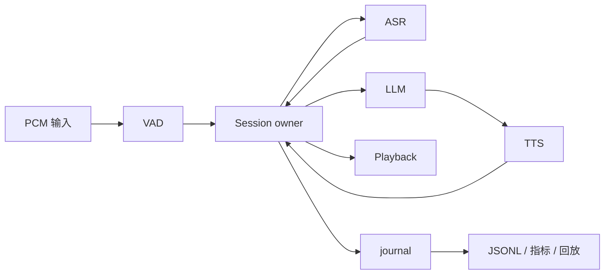

# Voice Runtime

[](https://github.com/SihanTeng/voice-runtime/actions/workflows/ci.yml)

单会话语音 Runtime：PCM 进去，经过 VAD / endpoint / ASR / LLM / TTS，再播出来。

默认 Provider 都是可配置的 Fake。编排没有用 Pipecat、LiveKit Agents 或 Vocode。

音频约定：单声道 PCM16 / 16kHz，20ms 一帧（320 sample）。每帧带单调序号和采集时间。

## 怎么跑

需要 Rust **1.96.1**（仓库里的 `rust-toolchain.toml` 会选这个版本）和本机编译器。完整门禁还要 Git、Python 3.9+。环境细节见 [docs/SETUP.md](docs/SETUP.md)。不需要 API key、麦克风或扬声器。

```sh
git clone https://github.com/SihanTeng/voice-runtime.git
cd voice-runtime
./scripts/dev.sh doctor    # 看本机缺什么
./scripts/dev.sh setup     # 装仓库锁定的 Rust 和依赖
./scripts/dev.sh demo      # 跑一遍 C，大约等 5 秒
./scripts/dev.sh test      # 完整门禁
```

也可以直接用 Cargo：

```sh
cargo test --locked
cargo run --locked --release -- run --scenario all --output output
cargo run --locked --release -- replay output/C/trace.jsonl --output output/replay
```

这三条成功时退出码都是 0。C 场景开口到停播是 **120ms**，迟到 chunk 收到 **2** 个、播放 **0** 个。关闭后 `lifecycle.json` 里 `active_tasks` 为 0，`trace_complete` 为 true。

## 你会看到什么

终端会打出生成文本、实际听到的文本、播放时长、打断延迟和 stale 计数。每次运行写到独立的 `output/dev/run-*/`，完整 JSON 在 `stdout.json`。

这是模拟消费，扬声器不会出声。`played.wav` 是 Fake TTS 的方波，用来看截断和间隙，不是合成语音。

| 文件 | 干什么用 |
|---|---|
| `output/metrics.json` | A–E 指标 |
| `output/C/trace.jsonl` | 按时间解释这一次为什么是这个结果 |
| `output/C/playback-truth.json` | 生成 / 入队 / 听到 各到哪 |
| `output/C/lifecycle.json` | 关没关干净 |
| `output/C/sequence.mmd` | 从日志生成的时序图 |

## 结构



`Session::run` 是生命周期的 owner。状态只在一个 Tokio `LocalSet` 上转：谁在听、当前 generation 是谁、播放队列里有什么。VAD / ASR / LLM / TTS 在旁边的任务里跑，通过有界通道把事件送回来。

公开入口是 `Session::new(config, factory, clock, sink)`，返回 session 和可克隆的 handle。handle 可以 `send_audio`、`cancel_generation`、`close`。`close()` 只是发出关闭请求，资源真正释放要等 `run()` 返回。

`session.rs` 拆分成几个文件是为了维护性，不是多了一层服务。打断时撤销 generation、结算已播、清队列，都还在同一次同步转换里，中间没有 await。

| 模块 | 管什么 |
|---|---|
| `session/input.rs` | 语音候选、ASR 准入、endpoint |
| `session/generation.rs` | generation 创建/撤销、下一轮上下文、播放切换 |
| `session/lifecycle.rs` | 任务监督和关闭 |
| `playback` | 唯一能写 sink 的地方，也是播放账本 |
| `audit` | 只读 trace，独立重建同一本账 |
| `fake` / `clock` / `wav` | Fake Provider、可注入时钟、文件输入 |

队列都有上限。输入和 ASR 各 50 帧，Provider 事件和 LLM→TTS 各 32 项，每个 generation 在途音频最多 8000 sample（500ms）。顶满就报错或取消这一轮，不会偷偷扩容。具体数字在 `src/session/config.rs`。

## 配置

四个 Provider 都可以改首包延迟、chunk 间隔、抖动、超时，以及 cancel 之后还吐几个迟到包。例子在 `examples/`：

```sh
cargo run --locked --release -- run --scenario C --config examples/jitter.json --output output/jitter
cargo run --locked --release -- run --scenario E --config examples/late.json --output output/late
# 这个会非零退出，那是故意的超时
cargo run --locked --release -- run --scenario A --config examples/timeout.json --output output/timeout
```

`--seed` / `--jitter-ms` 可以盖掉所有 Provider 的种子和额外抖动。省略某个 Provider 对象时用该阶段默认值；写了对象但漏字段，漏的那些走 `Timing::default()`。所以示例里把 VAD 0/0、ASR 40/0、LLM 80/20、TTS 60/5 都写出来了。TTS 默认 cancel 后仍返回 2 个 chunk。

核心测试用虚拟时钟，按下一个截止时间推进，不靠一次大幅 `advance` 把不同事件同时叫醒。真实时间打断另有测试，断言开口到停播 ≤250ms。

## 测试

```sh
cargo fmt --all
cargo test --locked --test scenarios    # A–E，包括旧包跨新回复到达
cargo test --locked --test endpointing  # 700ms 犹豫，不靠整句关键词
cargo test --locked --test playback     # 词中截断、重复包、UTF-8 边界
cargo test --locked --test faults       # 超时、panic、关闭、属性案例
cargo test --locked --test replay       # 独立账本和坏日志
cargo test --locked --features real-vad --test wav
sh scripts/check.sh                     # 格式、Clippy、测试、release、hook 自检
```

默认 34 项 Rust 测试，打开全部 features 是 35 项，另有 2 项 Python 脚本测试。准备往仓库提交时才需要 `sh scripts/install-hooks.sh`；只跑验收不用装 hook。

CI 在 push / PR 上跑同一套门禁：[GitHub Actions](https://github.com/SihanTeng/voice-runtime/actions/workflows/ci.yml)。

## 场景结果

虚拟时钟、默认配置：

| 场景 | Endpoint | 说完 → 首音频 | 开口 → 停播 | 重叠 | stale 收到 / 播放 |
|---|---:|---:|---:|---:|---:|
| A 完整句 | 240ms | 380ms | — | 0 | 0 / 0 |
| B 停 700ms 再续 | 最终结束后 240ms | 380ms | — | 0 | 0 / 0 |
| C 播放中打断 | 每轮 240ms | 每轮 380ms | 120ms | 120ms | 2 / 0 |
| D 80ms 噪声 | 240ms | 380ms | 没有正式打断 | 0 | 0 / 0 |
| E 取消后迟到包 | 每轮 240ms | 每轮 380ms | 120ms | 120ms | 2 / 0 |

C 的 120ms 拆开是检测 20ms + 连续语音确认 100ms + owner 停播 0ms。最后这项是 0，因为撤销和结算在同一次同步转换里做完，没有去测声卡排空。380ms 里是 endpoint 240 + LLM 80 + TTS 60，没有再等整句合成完。

初版做到可验收大约 **65 分钟**（含依赖下载和门禁）。编译好的 release 跑完 A–E 大约 **1.5 秒**。记录在 `sample-output/validation.json`。

核心链路做完了。另外加了虚拟时钟、WAV、WebRTC VAD、输入 jitter/丢帧/乱序、属性测试和并发关闭、8kHz G.711、从日志出时序图。没做真实 ASR/LLM/TTS、麦克风、AEC、网络服务和部署。journal 先放在有界内存里，正常关闭后再写成 JSONL；进程崩溃会丢还没导出的那一段。

设计上的取舍见 [DESIGN.md](DESIGN.md)。

## AI 怎么用的

实现阶段主要用 Codex 写 Rust、补测试、查 Tokio 文档。

架构上这几条是我定的，后面代码都按这个写：

- session 只有一个 owner，状态不在多线程里抢
- 每轮 generation 有自己的 ID，旧包对不上就丢掉
- 播放进度只看 sink 实际 consume 了多少 sample
- `cancel()` 只是通知，不代表上游已经停

提交的代码我理解。owner 事件循环、endpoint、打断、Playback 账本、关闭时的 join，我能讲清楚为什么这样写。
