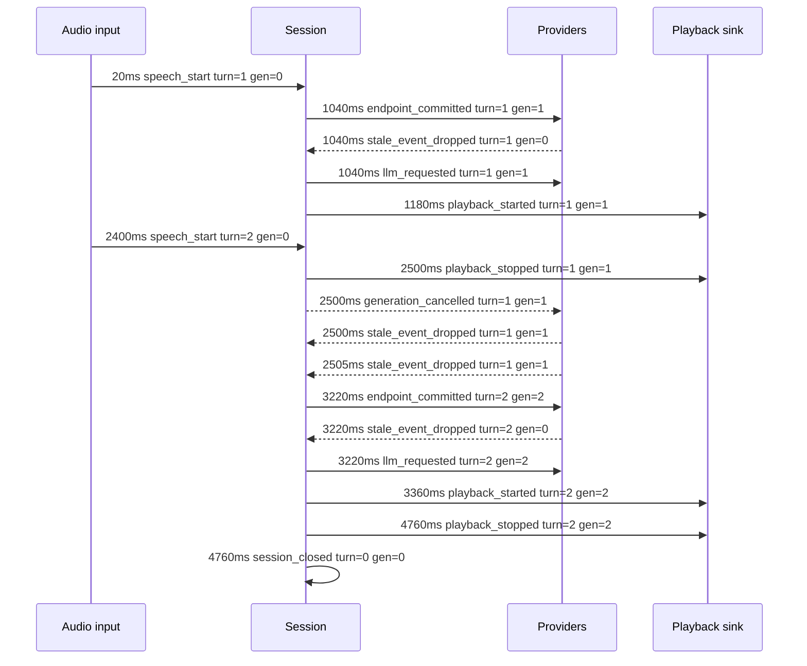

# C 场景时序图

```mermaid
sequenceDiagram
    participant U as Audio input
    participant R as Session
    participant P as Providers
    participant S as Playback sink
    U->>R: 20ms speech_start turn=1 gen=0
    R->>P: 1040ms endpoint_committed turn=1 gen=1
    P-->>R: 1040ms stale_event_dropped turn=1 gen=0
    R->>P: 1040ms llm_requested turn=1 gen=1
    R->>S: 1180ms playback_started turn=1 gen=1
    U->>R: 2400ms speech_start turn=2 gen=0
    R->>S: 2500ms playback_stopped turn=1 gen=1
    R-->>P: 2500ms generation_cancelled turn=1 gen=1
    P-->>R: 2500ms stale_event_dropped turn=1 gen=1
    P-->>R: 2505ms stale_event_dropped turn=1 gen=1
    R->>P: 3220ms endpoint_committed turn=2 gen=2
    P-->>R: 3220ms stale_event_dropped turn=2 gen=0
    R->>P: 3220ms llm_requested turn=2 gen=2
    R->>S: 3360ms playback_started turn=2 gen=2
    R->>S: 4760ms playback_stopped turn=2 gen=2
    R->>R: 4760ms session_closed turn=0 gen=0
```
